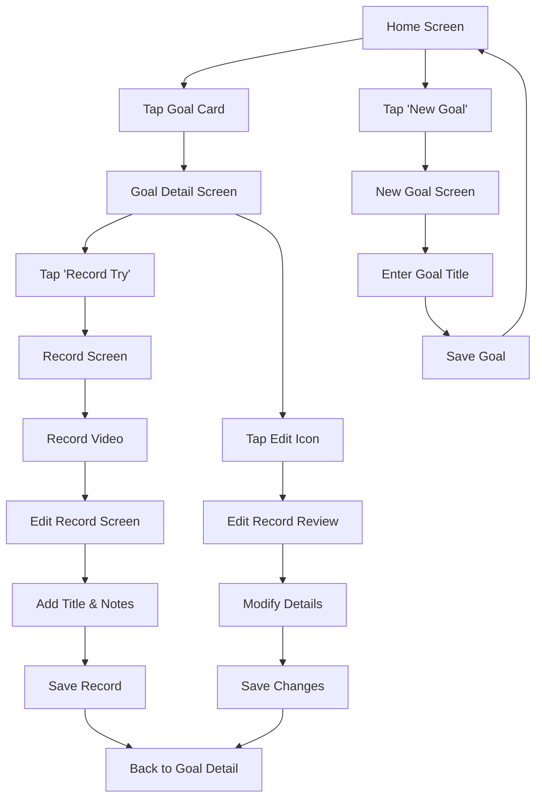

# 21 Try App 🎯

A Flutter goal tracking application based on the **21 Try Method** - the idea that it takes 21 attempts to master any skill or achieve any goal. This app helps users set goals and systematically track their progress through 21 documented attempts.

## 🌟 Core Concept

The app is built around the principle that **21 tries** are sufficient to achieve mastery or complete any goal. Each attempt is documented with video evidence and reflective notes, creating a comprehensive learning journey.

## 🚀 Features Overview

### 📊 **Goal Management**
- **Create Goals**: Set new personal or professional objectives
- **Goals Dashboard**: Visual overview of all active goals with progress indicators
- **Progress Tracking**: Real-time progress visualization (X/21 attempts)
- **Goal Details**: Comprehensive view of each goal's journey

### 🎥 **Attempt Documentation**
- **Video Recording**: Capture video evidence of each attempt
- **Record Tries**: Built-in camera interface with recording capabilities
- **Media Management**: Integrated photo library management
- **Attempt Editing**: Add titles, descriptions, and reflective notes

### 📝 **Reflection & Review**
- **Timeline View**: Chronological display of all attempts
- **Edit Records**: Modify titles and add detailed descriptions
- **Progress Visualization**: Linear progress bars and attempt counters
- **Review Interface**: Easy access to edit and review past attempts

## 📱 User Flow & Navigation

### 🏠 **Main User Journey**
```
Home Screen → Goal Detail → Record Try → Edit Record → Back to Goal Detail
     ↓              ↓             ↓            ↓              ↓
Goals List → Progress View → Camera UI → Add Notes → Updated Timeline
```

### 🔄 **Detailed User Flow**

#### **1. Starting Point: Home Screen**
- **Entry Point**: App launch
- **Display**: List of all created goals
- **Actions**: 
  - Tap goal → Navigate to Goal Detail
  - Tap "New Goal" → Create new goal
- **Navigation**: Bottom navigation (Home/Goals/Profile)

#### **2. Goal Creation Flow**
```
Home Screen → [Tap "New Goal"] → New Goal Screen → [Enter goal title] → [Tap "Next"] → Back to Home
```
- **Input**: Goal title/description
- **Process**: Save to database with UUID
- **Result**: New goal appears in goals list

#### **3. Goal Management Flow**
```
Home Screen → [Tap Goal Card] → Goal Detail Screen
```
- **Display**: 
  - Goal title in header
  - Progress section (X/21 attempts with progress bar)
  - Timeline of all attempts
  - "Record Try" button
- **Actions**:
  - View attempt timeline
  - Edit individual records
  - Record new attempt

#### **4. Recording New Attempt Flow**
```
Goal Detail → [Tap "Record Try"] → Record Screen → [Record Video] → [Stop Recording] → Edit Record Screen → [Add Details] → [Save] → Back to Goal Detail
```

**4a. Record Screen**
- **Interface**: Full-screen camera view
- **Features**: 
  - Back camera video recording
  - Recording timer
  - Stop/Start recording button
- **Actions**: Record video → Auto-navigate to edit screen

**4b. Edit Record Screen**
- **Display**: Video preview with playback controls
- **Input Fields**:
  - Record title (text input)
  - Notes/description (text area)
- **Actions**: Save changes → Return to goal detail

#### **5. Review & Edit Flow**
```
Goal Detail → [Tap Edit Icon on Record] → Edit Record Review Screen → [Modify Details] → [Save Changes] → Back to Goal Detail
```
- **Features**:
  - Video playback with Chewie player
  - Editable title and description
  - Save changes functionality
- **Navigation**: Seamless return to goal timeline

## 📁 Application Architecture

### 🏗️ **Screen Structure & Responsibilities**

| Screen | File | Primary Function | Key Features |
|--------|------|------------------|--------------|
| **Home Screen** | `home_screen.dart` | Goals dashboard & navigation hub | Goals list, navigation bar, create goal button |
| **Goal Detail** | `goal_detail_screen.dart` | Individual goal management | Progress tracking, timeline view, record button |
| **New Goal** | `new_goal_screen.dart` | Goal creation interface | Text input, save functionality |
| **Record Screen** | `record_screen.dart` | Video capture interface | Camera controls, recording timer |
| **Edit Record** | `edit_record_screen.dart` | New record editing | Video preview, title/notes input |
| **Edit Record Review** | `edit_record_review_screen.dart` | Existing record modification | Video playback, edit existing records |

### 🎨 **UI Components**

| Component | File | Usage | Description |
|-----------|------|-------|-------------|
| **Goal Card** | `goal_card.dart` | Home screen | Goal preview with progress indicator |
| **Bottom Nav Bar** | `bottom_nav_bar.dart` | All main screens | Navigation between app sections |

### 💾 **Data Management**

| Component | File | Responsibility |
|-----------|------|----------------|
| **Models** | `isar_models.dart` | Data structure definitions |
| **Database Service** | `isar_service.dart` | CRUD operations, data persistence |
| **Camera Service** | `camera_service.dart` | Media capture and management |

### 🎨 **Design System**
| Component | File | Purpose |
|-----------|------|---------|
| **Color Palette** | `app_colors.dart` | Consistent theming |

## 🗃️ **Data Models**

### **Goal Model**
```dart
class Goal {
  Id id;                    // Auto-increment local ID
  String uuid;              // Stable cross-device ID
  String title;             // Goal name/description
  DateTime createdAt;       // Creation timestamp
  IsarLinks<Record> records; // Associated attempts
}
```

### **Record Model**
```dart
class Record {
  Id id;                    // Auto-increment local ID
  String uuid;              // Stable cross-device ID
  String title;             // Attempt title
  String description;       // Reflective notes
  String assetId;           // Photo library identifier
  DateTime createdAt;       // Attempt timestamp
  IsarLink<Goal> goal;      // Parent goal reference
}
```

## 🔄 **Key User Interactions**

### **Navigation Patterns**
1. **Tab Navigation**: Bottom navigation for main sections
2. **Push Navigation**: Screen-to-screen for detailed views
3. **Modal Navigation**: Full-screen overlays for creation/editing

### **Data Flow**
1. **Create Goal** → Save to Isar database → Refresh home screen
2. **Record Attempt** → Save video to photo library → Create record with assetId
3. **Edit Record** → Update database record → Refresh timeline
4. **View Progress** → Real-time calculation from record count

### **State Management**
- **Local State**: Screen-specific UI state with setState
- **Route Awareness**: Automatic refresh when returning from child screens
- **Database Integration**: Isar for persistent data storage

## 🛠️ **Technical Features**

### **Video Management**
- **Recording**: Camera integration with recording timer
- **Storage**: Photo library integration with asset IDs
- **Playback**: Chewie video player for review
- **Editing**: Video preview during record editing

### **Database Features**
- **Local Storage**: Isar database for offline functionality
- **Relationships**: Linked Goal-Record data model
- **UUIDs**: Stable identifiers for potential cloud sync

### **UI/UX Features**
- **Dark Theme**: Consistent dark color scheme
- **Custom Fonts**: Manrope font family
- **Progress Visualization**: Linear progress bars
- **Responsive Design**: Adaptive layouts

## Getting Started

### Prerequisites

- Flutter SDK (>=2.17.0)
- Dart SDK
- Android Studio / VS Code with Flutter extensions

### Installation

1. Clone this repository
2. Download Manrope font family and place the font files in `fonts/` directory:
   - Manrope-Regular.ttf (weight 400)
   - Manrope-Medium.ttf (weight 500)
   - Manrope-Bold.ttf (weight 700)

3. Run `flutter pub get` to install dependencies
4. Run `flutter run` to start the app

## Font Setup

Download the Manrope font from [Google Fonts](https://fonts.google.com/specimen/Manrope) and create a `fonts` directory in the project root with the following files:
- `fonts/Manrope-Regular.ttf`
- `fonts/Manrope-Medium.ttf`
- `fonts/Manrope-Bold.ttf`

## Color Scheme

The app uses a dark green color palette:
- Background: #122117
- Card Background: #24472E
- Primary (Accent): #12ED5C
- Text Primary: #FFFFFF
- Text Secondary: #91C9A3

## 📂 **Project Structure**

```
📁 _21try/
├── 📄 main.dart                        # App entry point & configuration
├── 📁 models/
│   ├── 📄 isar_models.dart            # Goal & Record data models
│   └── 📄 isar_models.g.dart          # Generated Isar code
├── 📁 screens/
│   ├── 📄 home_screen.dart            # Main goals dashboard
│   ├── 📄 goal_detail_screen.dart     # Individual goal management
│   ├── 📄 record_screen.dart          # Video recording interface
│   ├── 📄 edit_record_screen.dart     # New record editing
│   ├── 📄 edit_record_review_screen.dart # Existing record editing  
│   ├── 📄 new_goal_screen.dart        # Goal creation form
│   └── 📄 try_record_detail_screen.dart # (Placeholder)
├── 📁 services/
│   ├── 📄 isar_service.dart           # Database operations
│   └── 📄 camera_service.dart         # Camera & media management
├── 📁 utils/
│   └── 📄 app_colors.dart             # Design system colors
├── 📁 widgets/
│   ├── 📄 goal_card.dart              # Goal display component
│   └── 📄 bottom_nav_bar.dart         # Navigation component
└── 📁 fonts/                          # Manrope font family
    ├── 📄 Manrope-Regular.ttf
    ├── 📄 Manrope-Medium.ttf
    └── 📄 Manrope-Bold.ttf
```

## 🖥️ **Screen Details**

### **1. Home Screen** (`home_screen.dart`)
**Purpose**: Main dashboard and entry point
- **Header**: "Goals" title with settings icon
- **Content**: Scrollable list of goal cards
- **Actions**: 
  - Tap goal card → Navigate to goal detail
  - Tap "New Goal" button → Create goal
- **Navigation**: Bottom navigation bar (Goals tab active)

### **2. Goal Detail Screen** (`goal_detail_screen.dart`) 
**Purpose**: Individual goal management and progress tracking
- **Header**: Goal title with back button
- **Progress Section**: 
  - "Almost there!" text
  - Progress counter (X/21)
  - Linear progress bar
- **Timeline Section**: 
  - Chronological list of all attempts
  - Each record shows: title, date, description, edit button
- **Action Button**: "Record Try" button
- **Features**: Route-aware automatic refresh

### **3. New Goal Screen** (`new_goal_screen.dart`)
**Purpose**: Goal creation interface
- **Header**: "New goal" title with back arrow
- **Input**: Text field "What do you want to achieve?"
- **Action**: "Next" button to save goal
- **Behavior**: Saves to database and returns to home

### **4. Record Screen** (`record_screen.dart`)
**Purpose**: Video capture interface
- **Display**: Full-screen camera preview
- **Controls**: 
  - Recording timer (shows elapsed seconds)
  - Record/Stop button (64x64 circular)
  - Back button overlay
- **Process**: Auto-navigate to edit screen after recording
- **Features**: Background/front camera support, auto-saving

### **5. Edit Record Screen** (`edit_record_screen.dart`)
**Purpose**: Adding details to newly recorded attempts
- **Header**: "Add record" with close button  
- **Video Section**: Video player with playback controls
- **Input Section**: 
  - "Title" text field
  - "Add a note" text area
- **Action**: "Save Changes" button
- **Navigation**: Returns to goal detail on save

### **6. Edit Record Review Screen** (`edit_record_review_screen.dart`)
**Purpose**: Modifying existing attempt records
- **Header**: "Record review" with back button
- **Video Section**: Video player with Chewie controls
- **Edit Section**: 
  - Editable title field
  - Editable summary/notes field  
- **Action**: "Save Changes" button
- **Features**: Video player state management, error handling

## 📊 **Data Flow Diagram**



## 🎨 **UI Components Breakdown**

### **Goal Card Component**
- **Layout**: Horizontal card with text and image
- **Content**: Goal title, attempt count, tries remaining, random image
- **Styling**: Rounded corners, card background, consistent spacing
- **Interaction**: Tap to navigate to goal detail

### **Bottom Navigation Bar**
- **Tabs**: Home, Goals (active), Profile
- **Styling**: Border top, custom background, icon + text
- **State**: Current index highlighting
- **Behavior**: Tab switching with callback function

### **Progress Visualization**
- **Linear Progress Bar**: Shows completion percentage (attempts/21)
- **Counter Display**: "X/21" format
- **Color Coding**: Primary color for progress, muted for background

### **Video Player Integration**
- **Library**: Chewie + Video Player
- **Features**: Play/pause, seek, fullscreen
- **Error Handling**: Loading states and error messages
- **Memory Management**: Proper controller disposal

## License

This project is created for demonstration purposes.
